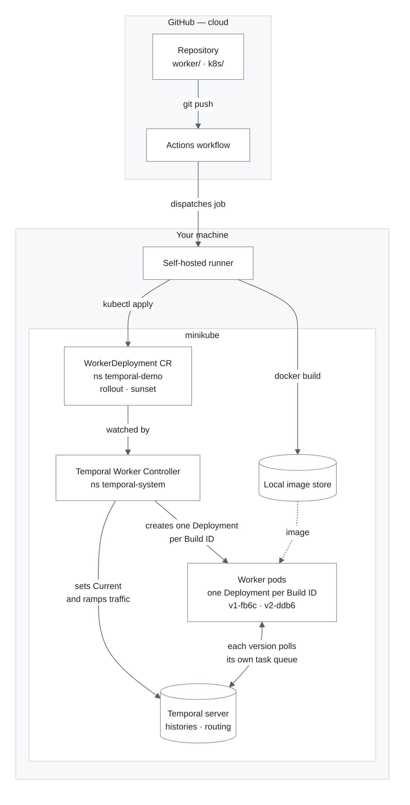
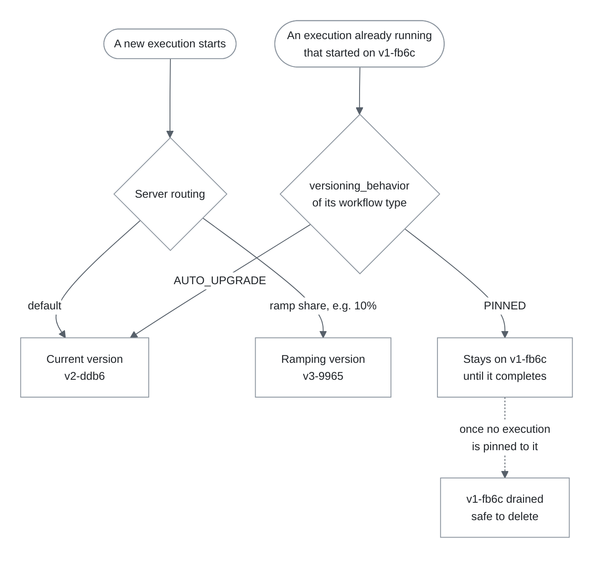
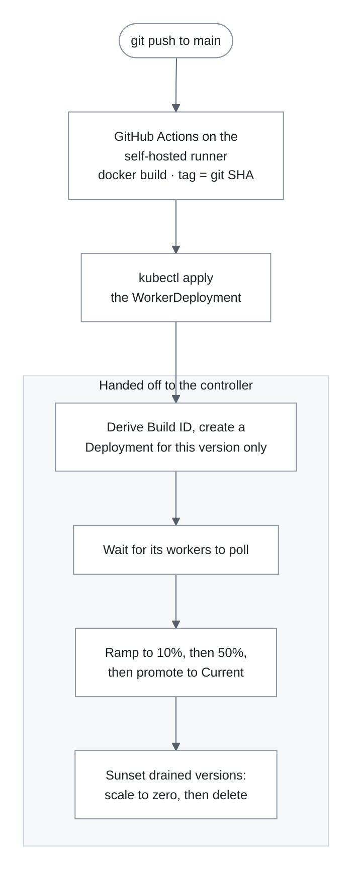

# Automating Temporal Worker Versioning with GitHub Actions and the Worker Controller

A workflow execution can run for
minutes, weeks, or months, and while it runs it is *bound to the code that
started it*. Terminate the pods holding that code and you have not completed a
deploy — you have orphaned every execution that was mid-flight.

This post walks through the problem and a working solution: Temporal's Worker
Versioning, the [Temporal Worker Controller](https://github.com/temporalio/temporal-worker-controller)
that automates it on Kubernetes, and a GitHub Actions pipeline that ties the
two together. Every output below is from a demo that actually runs
([the full repo is here](https://github.com/adam-quan/worker-controller-demo)).

---


## The moving parts

Six things have to cooperate. Worth having the map before the details:


Diagram source (mermaid)

Rendered to PNG so the background stays white in both light and dark themes —
mermaid's `background` theme variable styles labels and tooltips, not the
canvas, so an inline block would go transparent and pick up the reader's theme.
Theme and spacing are embedded in each `.mmd`, so the sources render the same
in any mermaid tool. Regenerate after editing
`[images/architecture.mmd](images/architecture.mmd)`:

```bash
npx -y @mermaid-js/mermaid-cli \
  -i docs/images/architecture.mmd -o docs/images/architecture.png -b white -s 2
```




Reading it as a chain of custody: **GitHub** holds the code and decides *when*
to deploy. The **self-hosted runner** is the only component that can see both
GitHub and the cluster, so it is where "build an image and update a manifest"
happens. The **controller** watches that manifest and is the only thing that
talks to Temporal about versions. The **Temporal server** owns the truth about
which Build ID is Current and which execution belongs to which version.
**Workers** are dumb by design: they poll for work on their own version and
have no idea a rollout is happening.

The one relationship that surprises people is the last: workflow executions do
not live in the worker pods. They live as event histories in the Temporal
server, which is why a worker pod can be deleted and its executions carry on
elsewhere — and why an execution *pinned* to a version needs that version's
pods to still exist.

---


## 1. Worker Versioning, and why you want it


### The problem it solves

A Temporal Workflow is deterministic replay. The server stores an event
history; the Worker rebuilds the workflow's state by re-executing your code
against that history. This is what makes Temporal durable — and it is also a
constraint: **if the code changes underneath a running execution, replay can
diverge**, and you get a non-determinism error.

Historically you had two options, both unpleasant:

1. **Patch every change in code** (`workflow.patched(...)`), accumulating
  branches you can never quite delete.
2. **Never change a running workflow's shape**, which in practice means
  draining every execution before deploying — impossible if your workflows run
   for weeks.

Worker Versioning gives you a third: **run the old and new code side by side,
and let the server route each execution to the version that owns it.**

### How it works

Each Worker registers with a **Worker Deployment** (a logical service, e.g.
`greeting-worker`) and a **Build ID** (a specific version of that service). The
server tracks which Build ID is *Current* — the one new executions start on —
and can additionally hold a *Ramping* version taking some percentage of new
executions.

In the Python SDK, that registration is a few lines:

```python
worker = Worker(
    client,
    task_queue=TASK_QUEUE,
    workflows=[GreetingWorkflow],
    activities=[compose_greeting, record_result],
    deployment_config=WorkerDeploymentConfig(
        version=WorkerDeploymentVersion(
            deployment_name=DEPLOYMENT_NAME,   # "greeting-worker"
            build_id=BUILD_ID,                 # "v2-ddb6"
        ),
        use_worker_versioning=True,
    ),
)
```

The interesting decision is per workflow — what should happen to an execution
already in flight when a newer version becomes Current?

```python
@workflow.defn(versioning_behavior=VersioningBehavior.PINNED)
class GreetingWorkflow: ...        # stays on its original version, forever

@workflow.defn(versioning_behavior=VersioningBehavior.AUTO_UPGRADE)
class SomeCompatibleWorkflow: ...  # moves to the new Current version
```

`PINNED` is the safe default: the execution finishes on the code that started
it, so you may change that workflow however you like — restructure it, delete
steps, reorder activities — without touching runs in flight.
`AUTO_UPGRADE` is for workflows you only ever change compatibly, and it lets
long-running executions pick up fixes without waiting for them to finish.

Those two settings, plus the server's Current/Ramping pointers, are the whole
routing model:


Diagram source (mermaid) — images/routing.mmd




The dashed edge is the part that makes automation possible: "drained" is a
state the server reports, so something else can watch for it and clean up. That
something is the controller.

### What this buys you

Watch it work. Here a workflow starts on `v1-fb6c` and parks. Then `v2-ddb6`
is deployed with a changed greeting and becomes Current. A **new** execution
picks up the new code:

```
Howdy, Bob! (served by build v2-ddb6)
```

While the **older, still-running** execution finishes on the version that
started it — old greeting, old build — even though it is no longer Current:

```
{'greeting': 'Hello, Alice! (served by build v1-fb6c)', 'recorded_by': 'v1-fb6c'}
```

That is the whole value proposition:

- **Deploy incompatible workflow changes safely.** No `patched()` branches
accumulating in your codebase for changes that only ever needed to apply to
new executions.
- **No non-determinism errors from deploys.** In-flight executions never see
code they did not start with.
- **Canaries for workflows.** Send 10% of new executions to a new version and
watch before committing.
- **Rollback is a routing change**, not a redeploy — the old version is still
running.

---


## 2. The Worker Controller, and why you want it

Worker Versioning gives you the *primitives*. Driving them is another matter.

I first built this demo with hand-rolled shell scripts, and they worked — but
the list of things they had to do kept growing:

- build the image and tag it with a Build ID
- create a **new** Kubernetes Deployment per version (never a rolling update —
that would kill the workers pinned executions still need)
- wait for those pods to actually poll before routing anything to them
- ramp traffic through 5% → 25% → 50%, pausing at each step
- health-check between steps and roll back on failure
- promote to Current
- track which old versions had drained, and delete only those

That was roughly 350 lines of bash, and it was subtly wrong in places. Two
examples that only surfaced through testing:

- `set-ramping-version --delete --build-id X` does **not** clear the ramp. It
zeroes X's percentage but leaves X installed as the ramping version — and in
that state the version never reports `drained`, so my cleanup script would
have kept its pods forever. You have to delete *without* `--build-id`.
- On a brand-new deployment there is no Current version to ramp *against*, so
the first rollout has to skip ramping entirely or it errors.

This is exactly the class of problem an operator should own. The **Temporal
Worker Controller** is Temporal's official Kubernetes controller for it. You
declare intent in a `WorkerDeployment` custom resource; the controller
reconciles reality toward it.

```yaml
apiVersion: temporal.io/v1alpha1
kind: WorkerDeployment
metadata:
  name: greeting-worker
  namespace: temporal-demo
spec:
  replicas: 2
  workerOptions:
    connectionRef:
      name: temporal-dev
    temporalNamespace: default

  rollout:
    strategy: Progressive          # or AllAtOnce, or Manual
    steps:
      - rampPercentage: 10
        pauseDuration: 60s
      - rampPercentage: 50
        pauseDuration: 60s

  sunset:
    scaledownDelay: 0s
    deleteDelay: 60s

  template:
    spec:
      containers:
        - name: worker
          image: worker-versioning-demo:a1b2c3d
          readinessProbe:
            httpGet: { path: /healthz, port: 8080 }
```

Everything my scripts did is now in that one object. The controller:

- **Derives the Build ID for you**, from the image reference plus a hash of the
pod template — producing IDs like `v2-ddb6`. Note the implication: changing
*any* pod-template field (an env var, a resource limit) is a new version, not
just a new image.
- **Injects the worker's identity.** `TEMPORAL_ADDRESS`,
`TEMPORAL_NAMESPACE`, `TEMPORAL_DEPLOYMENT_NAME` and
`TEMPORAL_WORKER_BUILD_ID` are set on every container it creates. Your worker
reads them; it never computes them. (Set them yourself and you will register
a version the controller is not routing to — a genuinely confusing failure.)
- **Creates one Deployment per version** and leaves older ones alone.
- **Ramps and promotes** according to `rollout`.
- **Sunsets drained versions** according to `sunset` — scaling to zero and
deleting once Temporal reports no execution is pinned to them any more. The
garbage collection I had written by hand is a two-field policy.

---


## 3. GitHub Actions, and the self-hosted runner


### How Actions works, briefly

A GitHub Actions **workflow** is YAML in `.github/workflows/`. It declares:

- **Events** that trigger it (`on:`) — a push, a manual dispatch, a schedule.
- **Jobs**, each of which gets a fresh machine (a **runner**).
- **Steps** within a job — either shell commands or reusable **actions**.

Our trigger is scoped so that unrelated commits do not redeploy workers:

```yaml
on:
  push:
    branches: [main]
    paths:
      - "worker/**"
      - "k8s/**"
      - "scripts/deploy.sh"
  workflow_dispatch:
    inputs:
      image_tag:
        description: "Set to a previously built tag to roll back."
```

Two details worth copying. A `concurrency` group prevents two rollouts racing
for the same target version:

```yaml
concurrency:
  group: worker-version-deploy
  cancel-in-progress: false
```

And `workflow_dispatch` gives you a manual rollback path: re-run with a
previously built tag. The controller recognises a return to a known-good
version as a rollback and applies it immediately rather than re-ramping.

### Why a self-hosted runner

GitHub-hosted runners are ephemeral VMs in GitHub's cloud. They can reach
anything on the public internet — and nothing else. Our Kubernetes cluster is
minikube on a laptop, which has no public address, so a hosted runner
physically cannot deploy to it:

```yaml
jobs:
  deploy:
    runs-on: self-hosted
```

A self-hosted runner is a small agent you run on your own machine. It polls
GitHub for jobs, executes them locally, and reports back. Because it runs where
your tooling already lives, `kubectl`, `minikube` and `docker` are simply
available:

```bash
# Settings → Actions → Runners → New self-hosted runner
./config.sh --url https://github.com/<you>/<repo> --token <token>
./run.sh
```

**Two caveats worth stating plainly.** First, a self-hosted runner executes
whatever the workflow says, as the user running the agent, on a machine with
your credentials. Never attach one to a public repository that accepts pull
requests from forks — a PR can modify the workflow file and run arbitrary code
on your machine. Use them on private repos, or with strict approval settings.
Second, runners are stateful: files, Docker images and caches persist between
jobs. Convenient, but it means a job can pass because of something a previous
job left behind.

In production none of this is exotic — you would point `kubectl` at a real
cluster and push images to a real registry, and a GitHub-hosted runner would do
fine. The self-hosted runner here is a consequence of the cluster being local,
not of the architecture.

---


## 4. Putting it together: the pipeline

Here is the entire deployment step:

```bash
docker build -t worker-versioning-demo:$SHA worker/
kubectl apply -f -   # the WorkerDeployment, with the new image
```

That is genuinely all the pipeline does. The image tag is the Git SHA, so
"what code is version `v2-ddb6` running?" is answerable with `git show`.
Everything else belongs to the controller:


Diagram source (mermaid) — images/pipeline.mmd




The division of labour is the point. CI does what CI is good at — turning a
commit into an artifact and recording intent. The controller does what a
control loop is good at — driving the cluster toward that intent, watching,
and reacting over minutes.

A real rollout, as the pipeline reports it:

```
==> Building worker-versioning-demo:v2 inside minikube's Docker daemon
==> Pointing WorkerDeployment/greeting-worker at worker-versioning-demo:v2
==> Waiting for the controller to roll out the new version
    target=v2-ddb6 current=v1-fb6c ramp=0%  (WaitingForPollers)
    target=v2-ddb6 current=v1-fb6c ramp=0%  (WaitingForPromotion)
    target=v2-ddb6 current=v1-fb6c ramp=10% (Ramping)
    target=v2-ddb6 current=v1-fb6c ramp=50% (Ramping)
    rollout complete: v2-ddb6 is Current
```

And afterwards, with no cleanup step anywhere in the pipeline, `v1-fb6c` is
gone — drained, scaled to zero, deleted, because `spec.sunset` said so.

### Things that bit me

A few practical notes from getting this working, since they are the kind of
thing that costs an afternoon:

- `kubectl wait --for=condition=Ready` **is a trap on this resource.** After
you apply a new image, the CR still carries `Ready=True` from the *previous*
rollout, so the wait returns instantly and CI reports success before anything
has happened. Poll until `status.targetVersion.buildID == status.currentVersion.buildID` instead.
- **Deleting a** `WorkerDeployment` **is not instant.** A
`temporal.io/delete-protection` finalizer holds it while the controller
removes versions from the Temporal server, and a version cannot be removed
while it still has *active pollers*. Expect `Terminating` for several minutes
after the pods stop. Scaling the versioned Deployments to zero first speeds
it up considerably.
- **The rollout policy belongs in the manifest, not the pipeline.** Ramp steps
and pause durations live in the `WorkerDeployment`, which means changing how
you deploy is a reviewable diff rather than an edit to CI YAML.
- **Prerequisites are real**: Temporal Server 1.29.1+, and cert-manager for the
controller's webhook TLS.

---


## 5. Summary

Workflow code is not stateless service code. An execution outlives the deploy
that started it, and pretending otherwise produces non-determinism errors and
orphaned work. Three pieces solve it cleanly, each doing one job:


| Layer                 | Responsibility                                                                                                                                                                                     |
| --------------------- | -------------------------------------------------------------------------------------------------------------------------------------------------------------------------------------------------- |
| **Worker Versioning** | Runs multiple code versions side by side and routes each execution to the version that owns it. `PINNED` workflows finish where they started; `AUTO_UPGRADE` workflows follow the Current version. |
| **Worker Controller** | Turns that into declarative Kubernetes. Derives Build IDs, creates a Deployment per version, ramps traffic, promotes, and garbage-collects drained versions.                                       |
| **GitHub Actions**    | Turns a commit into an image and records intent by updating one field. A self-hosted runner is only needed when the cluster is not publicly reachable.                                             |


What I would take away from building it twice — once by hand, once with the
controller:

1. **The hard part is not ramping traffic, it is knowing when to stop.**
  Draining, sunsetting and rollback are where bespoke scripts get subtly
   wrong. Those are exactly the parts a control loop should own.
2. **Keep policy declarative.** When ramp steps and pause durations live in a
  manifest, your deployment strategy gets code review, history, and rollback
   for free.
3. **Validate before you ramp.** This demo shifts traffic as soon as the new
  pods are healthy, which only proves the process started. The controller can
   also run a gate workflow pinned to the candidate Build ID and refuse to ramp
   until it passes — worth adding before you trust this in production.
4. **Pin by default.** `PINNED` costs you some old pods for a while and buys
  the freedom to change workflow code without thinking about replay. That is
   almost always the right trade.

The end state is a pipeline whose deploy step is two commands, and a rollout
that no human watches — one that will refuse to promote a broken build and
clean up after itself when the last execution on the old version finally
finishes.

---

*The demo repo, including the worker, manifests, and CI pipeline described
here, is at [github.com/adam-quan/worker-controller-demo](https://github.com/adam-quan/worker-controller-demo).*